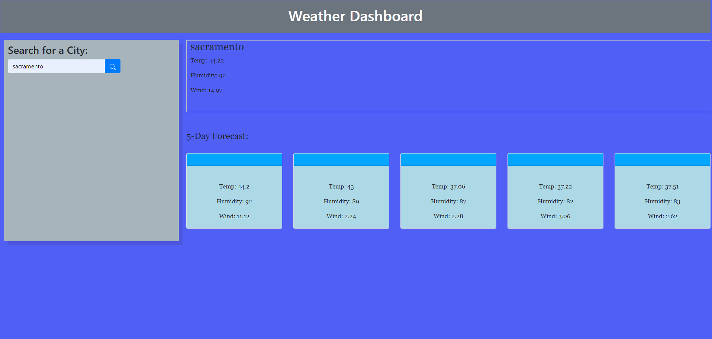

[![Contributors][contributors-shield]][contributors-url]
[![Forks][forks-shield]][forks-url]
[![Stargazers][stars-shield]][stars-url]
[![Issues][issues-shield]][issues-url]
[![MIT License][license-shield]][license-url]

<!-- PROJECT LOGO -->
 

    

  <h3 align="center">Weather Dashboard README</h3>

  

    Welcome to the Weather dashboard README, a great spot to get to know this project!
     
    <!-- <a href=""><strong>Explore the docs »</strong></a>
     
     
    <a href="">View Demo</a>
    ·
    <a href="">Report Bug</a>
    ·
    <a href="\">Request Feature</a> -->
  

<!-- TABLE OF CONTENTS -->

  
Table of Contents

  <ol>
    <li>
      <a href="#about-the-project">About The Project</a>
      <ul>
        <li><a href="#built-with">Built With</a></li>
      </ul>
    </li>
    <!-- <li><a href="#getting-started">Getting Started</a></li> -->
    <!-- <li><a href="#usage">Usage</a></li>
    <li><a href="#roadmap">Roadmap</a></li> -->
    <li><a href="#contributing">Contributing</a></li>
    <li><a href="#contact">Contact</a></li>
    <li><a href="#acknowledgments">Acknowledgments</a></li>
  </ol>

<!-- ABOUT THE PROJECT -->
## About The Project

I was tasked to create weather dashboard app so that a user check the weather and get a 5 day forecast for a location of their daily tasks.

I want a user to be able to:
 
GIVEN a weather dashboard with form inputs
WHEN I search for a city
THEN I am presented with current and future conditions for that city and that city is added to the search history
WHEN I view current weather conditions for that city
THEN I am presented with the city name, the date, an icon representation of weather conditions, the temperature, the humidity, and the wind speed
WHEN I view future weather conditions for that city
THEN I am presented with a 5-day forecast that displays the date, an icon representation of weather conditions, the temperature, the wind speed, and the humidity
WHEN I click on a city in the search history
THEN I am again presented with current and future conditions for that city
 

(<a href="#readme-top">back to top</a>)

### Built With

Below are the following technologies and applications utilized to help build the project. 

VS Code 
JavaScript 
HTML 
CSS 

(<a href="#readme-top">back to top</a>)

<!-- GETTING STARTED -->
## Getting Started

Below you'll be able to see screen shots of the deployed app.

(<a href="#readme-top">back to top</a>)

<!-- USAGE EXAMPLES -->
<!-- ## Usage

Here're some screenshots from early ideas of the wireframe. See how we went from initial plans to our full-functioning website.
 -->

(<a href="#readme-top">back to top</a>)

<!-- ROADMAP -->

(<a href="#readme-top">back to top</a>)

<!-- CONTRIBUTING -->
## Contributing

I strongly feel that contributing well throught and engaging suggestions are instrumental. I am an avid learner and want to let you know any contribution or suggestions are apprecaited.

If you truly believe you can contribute to making this website better, please fork the repo and create a pull request. If you do not wish to fork, you can open and create an issue with the tag "enhancement" or "suggestions". I will then be able to review it and take it into consideration. Lastly, please don't forget to give the project a star!

1. Fork the Project
2. Create your Feature Branch (`git checkout -b feature/newSuggestion`)
3. Commit your Changes (`git commit -m 'Add some NewSuggestion'`)
4. Push to the Branch (`git push origin feature/NewSuggestion`)
5. Open a Pull Request

(<a href="#readme-top">back to top</a>)

<!-- CONTACT -->
## Contact

Jared Saldate - GitHub [https://github.com/saldatecode]

Project Link: [https://github.com/danpoggetti/work-day-scheduler]

<!-- Demo Link: [] -->

(<a href="#readme-top">back to top</a>)

<!-- ACKNOWLEDGMENTS -->
## Acknowledgments

I want to acknowledge the many great and vast resouces that aided me in the work day scheduler app.

* [Google](https://www.google.com)
* [YouTube](https://www.youtube.com)
* [GitHub Pages](https://pages.github.com)
* [OwaisIslam](https://github.com/OwaisIslam)

(<a href="#readme-top">back to top</a>)

<!-- MARKDOWN LINKS & IMAGES -->
<!-- https://www.markdownguide.org/basic-syntax/#reference-style-links -->
[contributors-shield]: https://img.shields.io/github/contributors-anon/danpoggetti/work-day-scheduler?style=for-the-badge
[contributors-url]: https://github.com/danpoggetti/work-day-scheduler/graphs/contributors
[forks-shield]: https://img.shields.io/github/forks/danpoggetti/work-day-scheduler?style=for-the-badge
[forks-url]: https://github.com/danpoggetti/work-day-scheduler/network/members
[stars-shield]: https://img.shields.io/github/stars/danpoggetti/work-day-scheduler?style=for-the-badge
[stars-url]: https://github.com/danpoggetti/work-day-scheduler/stargazers
[issues-shield]: https://img.shields.io/github/issues/danpoggetti/work-day-scheduler?style=for-the-badge
[issues-url]: https://github.com/danpoggetti/work-day-scheduler/issues
[license-shield]: https://img.shields.io/github/license/danpoggetti/work-day-scheduler?style=for-the-badge
[license-url]: https://github.com/danpoggetti/work-day-scheduler/blob/main/LICENSE
[product-screenshot]: images/screenshot.png